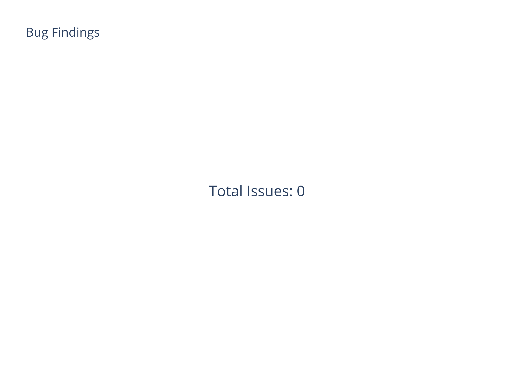

---
title: "Security Assessment"
author: [O2Lab VRust Team]
date: "11/03/2022 16:12:34"
page-background-opacity: 0.9
page-background: "./bg/VRust/VRustPageBG.png"
lang: "en"
titlepage: true
titlepage-text-color: "FFFFFF"
titlepage-rule-color: "360049"
table-use-row-colors: true

titlepage-rule-height: 0
titlepage-background: "./bg/VRust/VRust.png"
...

# Summary  

This report has been prepared for O2Lab VRust Team to discover issues and vulnerabilities in the source code of the O2Lab VRust Team project as well as any contract dependencies that were not part of an officially recognized library. A comprehensive examination has been performed, utilizing Static Analysis and Manual Review techniques.
The auditing process pays special attention to the following considerations:

* Testing the smart contracts against both common and uncommon attack vectors. 
                

* Assessing the codebase to ensure compliance with current best practices and industry standards.
                

* Ensuring contract logic meets the specifications and intentions of the client.
                

* Cross referencing contract structure and implementation against similar smart contracts produced
                by industry leaders.
                

* Thorough line-by-line manual review of the entire codebase by industry experts. 

 The security assessment resulted in findings that ranged from critical to informational. We recommend
addressing these findings to ensure a high level of security standards and industry practices.
We suggest
recommendations that could better serve the project from the security perspective:

*  Enhance general coding practices for better structures of source codes;

* Add enough unit tests to cover the possible use cases;

* Provide more comments per each function for readability, especially contracts that are verified in
public;

* Provide more transparency on privileged activities once the protocol is live.
    
    

# Overview  
## Project Summary
| Project Name | O2Lab VRust Team       | 
|--------------|----------| 
| Platform     | Ethereum | 
| Language     | Solana | 
| Crate     | owner_checks_insecure |
| GitHub Location      |    https://github.com/parasol-aser/vrust    | 
| sha256       | Unknown       | 

     

## Audit Summary

| Delivery Date | 11/03/2022       |
|--------------|----------|
| Audit Methodology     | Static Analysis      |
| Key Components        |      |

## Vulnerability Summary

**Vulnerability Level**|**Total**
:-----:|:-----:
 Critical|0
Major|0
Medium|0
Minor|0
Informational|0
Discussion|0

# Findings  

# Finding Statistic  

| Category | Count |
| :--- | :--- |

| ID | Category | Severity | Status |
| :--- | :--- | :--- | :---: |

# Appendix  

Copied from https://leaderboard.certik.io/projects/aave

## Finding Categories
### Gas Optimization

Gas Optimization findings do not affect the functionality of the code but generate different, more optimal EVM opcodes resulting in a reduction on the total gas cost of a transaction.

### Mathematical Operations
Mathematical Operation findings relate to mishandling of math formulas, such as overflows, incorrect operations etc.

### Logical Issue
Logical Issue findings detail a fault in the logic of the linked code, such as an incorrect notion on how block.timestamp works.

### Language Specific
Language Specific findings are issues that would only arise within Solidity, i.e. incorrect usage of private or delete.

### Coding Style
Coding Style findings usually do not affect the generated byte-code but rather comment on how to make the codebase more legible and, as a result, easily maintainable.

## Checksum Calculation Method
The "Checksum" field in the "Audit Scope" section is calculated as the SHA-256 (Secure Hash Algorithm 2 with digest size of 256 bits) digest of the content of each file hosted in the listed source repository under the specified commit. 

The result is hexadecimal encoded and is the same as the output of the Linux "sha256sum" command against the target file.

# Disclaimer

Copied from https://leaderboard.certik.io/projects/aave

This report is subject to the terms and conditions (including without limitation, description of services, confidentiality, disclaimer and limitation of liability) set forth in the Services Agreement, or the scope of services, and terms and conditions provided to you (“Customer” or the “Company”) in connection with the Agreement. This report provided in connection with the Services set forth in the Agreement shall be used by the Company only to the extent permitted under the terms and conditions set forth in the Agreement. This report may not be transmitted, disclosed, referred to or relied upon by any person for any purposes, nor may copies be delivered to any other person other than the Company, without CertiK’s prior written consent in each instance.

This report is not, nor should be considered, an “endorsement” or “disapproval” of any particular project or team. This report is not, nor should be considered, an indication of the economics or value of any “product” or “asset” created by any team or project that contracts CertiK to perform a security assessment. This report does not provide any warranty or guarantee regarding the absolute bug-free nature of the technology analyzed, nor do they provide any indication of the technologies proprietors, business, business model or legal compliance.

This report should not be used in any way to make decisions around investment or involvement with any particular project. This report in no way provides investment advice, nor should be leveraged as investment advice of any sort. This report represents an extensive assessing process intending to help our customers increase the quality of their code while reducing the high level of risk presented by cryptographic tokens and blockchain technology. Blockchain technology and cryptographic assets present a high level of ongoing risk. CertiK’s position is that each company and individual are responsible for their own due diligence and continuous security. CertiK’s goal is to help reduce the attack vectors and the high level of variance associated with utilizing new and consistently changing technologies, and in no way claims any guarantee of security or functionality of the technology we agree to analyze. The assessment services provided by CertiK is subject to dependencies and under continuing development. You agree that your access and/or use, including but not limited to any services, reports, and materials, will be at your sole risk on an as-is, where-is, and as-available basis. Cryptographic tokens are emergent technologies and carry with them high levels of technical risk and uncertainty. The assessment reports could include false positives, false negatives, and other unpredictable results. The services may access, and depend upon, multiple layers of third-parties.